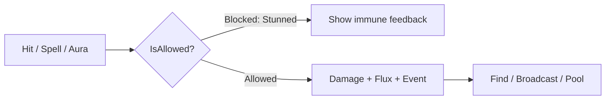
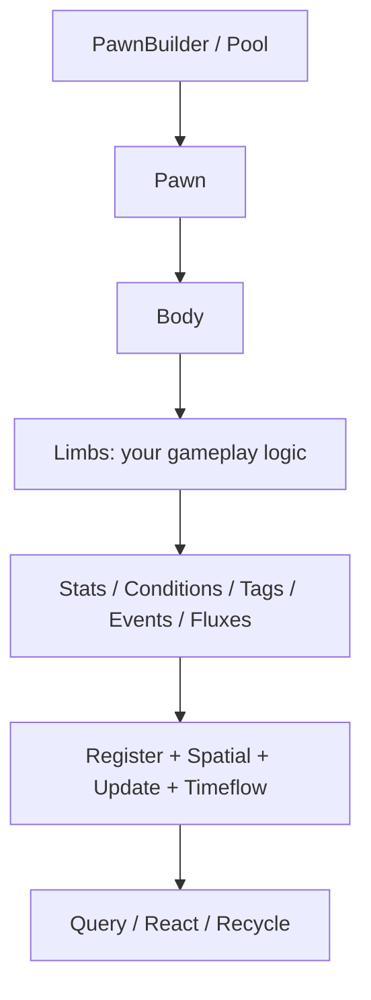
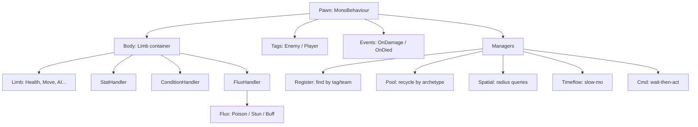
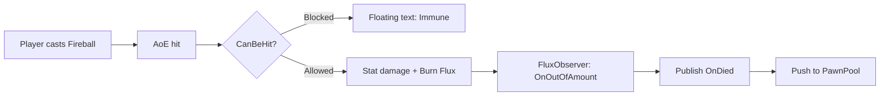

# SackranyPawn

Modular pawn framework for Unity — spawn, buff, stun, query, and recycle gameplay entities without boilerplate.

  

## 🎮 What It Does

**SackranyPawn** turns any `GameObject` into a gameplay-ready **Pawn**: a container with swappable **Limbs** (health, movement, AI), plus built-in **Stats, Conditions, Tags, Events,** and timed **Flux** effects.

It solves the *"every enemy/NPC needs health + stuns + buffs + pooling + queries"* problem — without hardcoding transitions or scattering `GetComponent` calls.

## ✨ Gameplay Use Cases

| You want to… | Use |
|---|---|
| Spawn waves of goblins / bullets | `PawnBuilder` + `PawnPool` |
| Stun, freeze, silence: "can't move/attack" | `Conditions` (`Block<CanMove>()`) |
| Buffs / debuffs: +50% damage, slow | `Stats` (`Modifiable<float>`) + `StatModifierFlux` |
| Poison, burn, shield-over-time | `Fluxes` with `Amount` + `Progress` |
| "Find nearest enemy in 10m" | `PawnSpatial` / `PawnPipeline` |
| Hit → damage → death → loot | `PawnEventBus` (`OnDamage` / `OnDied`) |
| Slow-mo, pause one boss, freeze all | `TimeFlow` (per-pawn + global) |
| Safe "do X if has Y" without null hell | `PawnMaybe` / `PawnChain` |



## 🧠 How It Works



One `Pawn` = identity + lifecycle. One `Body` = holds `Limbs`. Each `Limb` = one gameplay capability. Traits are just pre-built Limbs + helpers. Managers auto-track everything once `StartWork()` runs.

## 🏗 System Overview



| Component | Purpose |
|---|---|
| `Pawn` | Identity, lifecycle (`Run` / `StartWork` / `StopWork` / `Reset`), `Team`, `Archetype` |
| `Body` | Adds/removes/finds `Limbs`, routes `Update`/`Fixed`/`Late`, `Dynamic` vs `Sealed` |
| `Limb` | Your gameplay module. `Awake/Start/Reset/Dispose` + `IUpdateLimb` |
| `Stats` | `AStat<T>` values as `Modifiable<float>` (stack buffs). e.g. `MaxHealth`, `MoveSpeed` |
| `Conditions` | `ACondition<T>` gates (`CanMove`, `CanAttack`). `Block` / `Unblock` with counts |
| `Tags` | `IPawnTag` markers (`Tags.Enemy`). Drives teams + fast queries |
| `Events` | Per-pawn bus. `Subscribe<OnDied>` / `Publish<OnDied>` |
| `Fluxes` | Temporary stacked effects with `Amount` + `Progress` + `FluxObserver` |
| `Managers` | `PawnRegister`, `PawnPool`, `PawnSpatial`, `PawnUpdate`, `PawnTimeflow`, `PawnCmd` |
| `Helpers` | `PawnBuilder`, `PawnPipeline`, `PawnChain`, `PawnMaybe` |

## 🚀 Quick Start

**1. Install:** copy package into `Assets`, ensure references from `sackranyPawn.asmdef` exist: `UniTask`, `R3.Unity`, `ModifiableVariables`, `MackySoft.SerializeReferenceExtensions`.

**2. Configure:** add `Sackrany/Pawn` component to a prefab. `Body` already includes `StatHandler` + `ConditionHandler` by default. Set `WorkByDefault` if it should tick on `Awake`.

**3. Use:**

```csharp
using SackranyPawn.Entities;
using SackranyPawn.Traits.PawnTags;
using SackranyPawn.Traits.Stats;
using SackranyPawn.Traits.Conditions;

// Spawn + configure in one chain
var goblin = PawnBuilder.FromPrefab(enemyPrefab)
    .At(spawnPoint)
    .WithTag<Tags.Enemy>()
    .WithLimb(new HealthLimb { Max = 100 })
    .Run()
    .Build();

// Gameplay checks — no GetComponent spam
float hp = goblin.GetStatValue<MaxHealth>();
if (goblin.IsAllowed<CanMove>()) { /* move */ }

goblin.Block<CanMove>();   // stun
goblin.Unblock<CanMove>(); // recover

goblin.Event.Subscribe<Events.OnDied>(() => PawnPool.Push(goblin));
```

<details>
<summary>Pooling + queries</summary>

```csharp
using SackranyPawn.Managers;
using SackranyPawn.Components;

// Pre-warm 20 goblins, reuse by archetype (limb set)
enemyPrefab.PreWarmPool(20);
var p = enemyPrefab.Pop(); // or PawnPool.Pop(enemyPrefab)
p.Push();                  // or PawnPool.Push(p)

// Who's around?
PawnSpatial.GetInRadius(transform.position, 10f, results);
PawnSpatial.TryGetNearest(transform.position, 15f, out Pawn nearest);

// Who matches?
PawnRegister.GetAllPawnsWithTag<Tags.Enemy>(results);
PawnPipeline.All().WithTag<Tags.Enemy>().WithStatBelow<MaxHealth>(30f).ForEach(pawn =>
    pawn.Event.Publish<Events.OnDamage>()
);
```

</details>

## 🎯 Example Gameplay Flow

Fireball hits goblin → burn ticks → stun blocks movement → death recycles to pool:



```csharp
// On the projectile:
PawnPipeline.All()
    .WithTag<Tags.Enemy>()
    .WithinRadius(impactPos, 5f)
    .ForEach((Pawn pawn) =>
{
    if (pawn.IsBlocked<CanBeHit>()) return;

    pawn.Maybe<HealthLimb>(h => h.TakeDamage(40));
    pawn.Maybe<FluxHandler>(f => f.ApplyFlux<BurnFlux>(3)
        .Observe()
        .OnAmountDecreased(_ => pawn.Event.Publish<Events.OnDamage>())
        .OnOutOfAmount(_ => pawn.Event.Publish<Events.OnDied>()));
});

// Stun that auto-expires (built-in flux):
pawn.Maybe<FluxHandler>(f => f.ApplyFlux(new ConditionBlockFlux
{
    Condition = new CanMove()
}, 1));
```

Result in-game: enemies in radius flash, burn for 3 ticks, stunned ones can't move, dead ones vanish back to pool — no manual list management.

## 🔧 Configuration

| Setting | Purpose | Default |
|---|---|---|
| `Body.Mode` | `Dynamic`: add/remove at runtime. `Sealed`: reset-only | `Dynamic` |
| `Pawn.WorkByDefault` / `SetWorkByDefault()` | Auto `StartWork()` on `Awake` / pool pop | `false` unless `Run()` |
| `Pawn.TimeFlow` / `PawnTimeflow.TimeFlow` | Per-pawn / global timescale multiplier | `1` |
| `PawnSpatial.Configure(cellSize, axes, threshold)` | Grid tuning for radius queries | `10f`, `XZ`, `0f` |
| `StatHandler.Default` | Starting stats (`MaxHealth`, `MoveSpeed`…) | empty |
| `ConditionHandler.Default` | Starts blocked (e.g. `CanMove`) | empty |
| `PawnTag._defaultTags` | Inspector-set tags | empty |
| `FluxHandler.DefaultFluxes` | Fluxes applied on `Start` | empty |
| `[Dependency(optional)]` | Auto-inject sibling `Limb` / `Component` | required |
| `[UpdateOrder]` | `Limb` tick order | `0` |

## 🧩 Extending It

Add one file per concept. Prefer small examples:

```csharp
using System;
using SackranyPawn.Entities.Modules;
using SackranyPawn.Traits.Stats;
using SackranyPawn.Traits.Conditions;
using SackranyPawn.Traits.PawnTags;
using SackranyPawn.Traits.PawnEvents;
using SackranyPawn.Traits.Fluxes.Entities;

// New stat / condition / tag / event
[Serializable] public class Mana : AStat<Mana> {}
[Serializable] public class CanTeleport : ACondition<CanTeleport> {}
[Serializable] public class Boss : PawnTag<Boss> {}
public class OnRevive : AEvent<OnRevive> {}

// New behavior — auto-wired updates + dependencies
public class HealthLimb : Limb, IUpdateLimb
{
    [Dependency] StatHandler stats; // injected, fails Add if missing

    public float Max = 100;
    public void OnUpdate(float dt) { /* regen, dot, etc. */ }

    protected override void OnStart()
        => stats.Register<Mana>(Max);

    public void TakeDamage(float v)
    {
        if (Pawn.IsBlocked<CanBeHit>()) return;
        // ... subtract, publish Events.OnDamage / OnDied
    }
}

// New timed effect (tick via UniTask + public Token)
[Serializable] public class BurnFlux : Flux<BurnFlux>
{
    protected override void OnStart()
    {
        RunBurn().Forget();
        async Cysharp.Threading.Tasks.UniTaskVoid RunBurn()
        {
            try
            {
                while (!Token.IsCancellationRequested)
                {
                    await Cysharp.Threading.Tasks.UniTask.Delay(500, cancellationToken: Token);
                    if (!TickProgress(0.34f)) continue;
                    ChangeAmount(-1); // triggers observer -> OutOfAmount at 0
                }
            }
            catch (OperationCanceledException) { }
        }
    }
}
```

Hooks: implement `PawnPlugins.IPawnStartWorking`, `BodyPlugins.IBodyLimbAdded`, `LimbPlugins.ILimbStarting`, `FluxPlugins.IFluxStarting` via `PluginRegistry` for global systems.

## 📁 Project Structure

```text
SackranyPawn/
├── Components/Pawn.cs       # identity + lifecycle
├── Entities/                # PawnBase, Builder, Chain, Maybe, Pipeline, Body, Limb
│   └── Modules/             # Body.cs, Limb.cs, Attributes.cs ([Dependency] etc.)
├── Traits/
│   ├── Stats/               # StatHandler + AStat + defaults (MaxHealth, MoveSpeed...)
│   ├── Conditions/          # ConditionHandler + defaults (CanMove, CanAttack...)
│   ├── PawnTags/            # PawnTag + Tags.Enemy/Player...
│   ├── PawnEvents/          # PawnEventBus + Events.OnDamage/OnDied...
│   └── Fluxes/              # FluxHandler + Flux + Observer + built-ins
├── Managers/                # Register, Pool, Spatial, Update, Timeflow, Cmd, Bootstrap
├── Plugin/                  # IPlugin + lifecycle hooks
├── Cache/                   # registries, archetype hash, DI
└── Editor/                  # scene overlay, SubclassSelector UI
```

## ⚠️ Limitations

* Unity-only (`MonoBehaviour` + `PlayerLoop` hooks).
* Requires `UniTask`, `R3`, `ModifiableVariables`, `SerializeReferenceExtensions`.
* `PawnPool` groups by `Archetype` (limb set) — different limb configs = different pools.
* `Sealed` `Body` rejects runtime `Add`/`Remove`.
* `PawnSpatial` is a 2D grid (`XZ`/`XY`/`YZ`), not full 3D physics queries.
* No networking / save-load built-in — use `Serialize()` / `Deserialize()` on `ISerializableLimb` as starting point.
